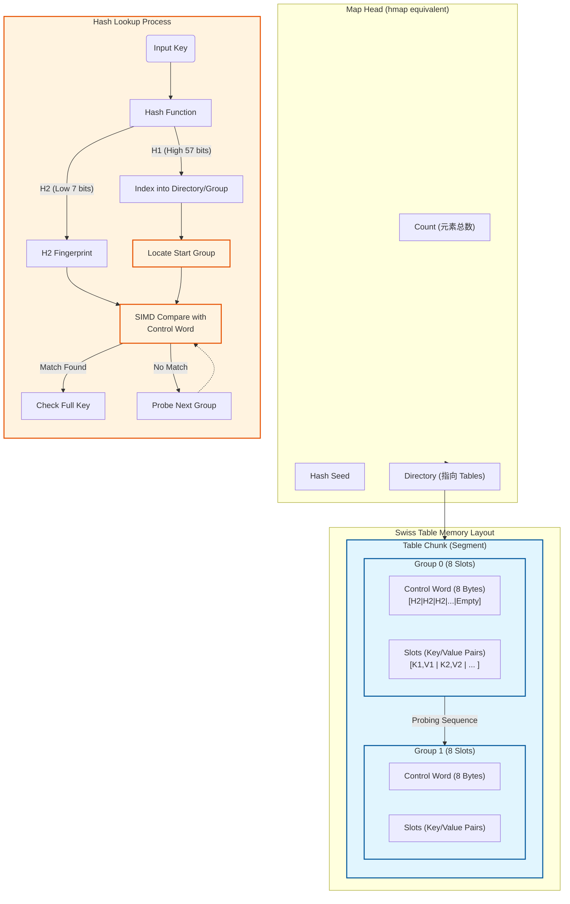

先了解一些计算机基本的内容

## 内存相关

### 字长与字节

1. 字长是 CPU 一次能处理的数据位数
   1. 32 位 CPU → 字长 = 32 bit = 4 字节
   2. 64 位 CPU → 字长 = 64 bit = 4 字节
2. 字长影响
   1. 寄存器宽度
   2. 指针 (pointer) 的大小
      1. 32 位系统：指针 = **4 字节**
      2. 64 位系统：指针 = **8 字节**
   3. CPU 处理数据的速度

string(”a”) 与[1]byte{’a’}内存占用情况？

字符 "a" 是 ASCII：

- 内容部分：1 字节
- string 头结构：
  - 64 位：16 字节
  - 32 位：8 字节

string("a") 总占用 = 16（头） + 1（内容） = 17 字节

------

[1]byte{'a'} = 1 字节

它不需要：

- 指针
- 长度字段
- 单独的堆分配

| 类型           | 占用                       |
| -------------- | -------------------------- |
| `[1]byte{'a'}` | **1 字节**                 |
| `string("a")`  | **17 字节（实际可能 24）** |

# String

源码：`src/runtime/string.go`

```go
type stringStruct struct {
    str unsafe.Pointer
    len int
}
```

它包含一个指向字符串存储数据的指针和一个长度数据。
**string类型是不可变**的，对于多字符串共享同一个存储数据是安全的。

```go
	s := "hello"
	t := s[2:3]

	//打印了 string header 的首 8 字节，也就是 Data pointer
	fmt.Printf("s header pointer: %x\n", *ps)
	fmt.Printf("t header pointer: %x\n", *pt)

	// 打印底层数据指针
	// t 指针 = s 指针 + 2
	sh := (*[2]uintptr)(unsafe.Pointer(&s))
	th := (*[2]uintptr)(unsafe.Pointer(&t))
    fmt.Printf("s Data pointer: %x, Len: %d\n", sh[0], sh[1])
    fmt.Printf("t Data pointer: %x, Len: %d\n", th[0], th[1])

	//指针地址
	fmt.Printf("s: %p, t:%p", &s, &t)

    // 测试底层数组共享（unsafe 仅演示）
	fmt.Printf("Offset: %d\n", th[0]-sh[0])
    b := (*[5]byte)(unsafe.Pointer(sh[0]))
    b[2] = 'X'
    fmt.Println("s:", s)
    fmt.Println("t:", t)
-----------------------
s header pointer: 7ff681bfa2ec
t header pointer: 7ff681bfa2ee

s Data pointer: c000010230, Len: 5
t Data pointer: c000010232, Len: 1
s: 0xc00008c3c0, t:0xc00008c3d0
Offset: 2
s: heXlo
t: X
```

# slice

1. slice是一个数组某个部分的引用。
2. 数组的slice并不会实际复制一份数据，它只是创建一个新的数据结构，包含了另外的一个指针，一个长度和一个容量数据。包括底层数组的分割，追加也一样。（长度不超过cap的情况下）

## slice扩荣机制

在对slice进行append等操作时，可能会造成slice的自动扩容。其扩容时的大小增长规则是： 

- 如果新的大小是当前大小2倍以上，则大小增长为新大小 
- 否则循环以下操作：
  - 如果当前大小小于1024，按每次2倍增长，
  - 否则每次按当前大小1/4增长。直到增长的大小超过或等 于新大小

源码：

```go
type slice struct {
    Data uintptr  // 指向底层数组
    Len  int      // 当前长度
    Cap  int      // 容量
}
```

创建与使用：

```go
// 创建
s := make([]int, 5)       // len=5, cap=5
s2 := make([]int, 5, 10)  // len=5, cap=10

// append
s = append(s, 4)

// 切片共享底层数组
s := []int{1,2,3,4,5}
t := s[1:4]                // t 底层数组指向 s[1]
t[0] = 100
fmt.Println(s)             // [1,100,3,4,5]

// 复制切片
src := []int{1,2,3}
dst := make([]int, len(src))
copy(dst, src)              // 复制数据
```

# make和new

new返回一个指向已清零内存的指针，

而make返回一个复杂的 结构。

一句话，**（new一个指针，make一个初始化的实例）**

new可以用在所有类型，new(*T)

而make是固定的，仅仅包括，slice,map,channel

```go
s := make([]string, 5, 10)
m := make(map[string]int)
ch := make(chan string)
```


# Map

旧版本使用的是hmap+bmap，即分桶+溢出链表机制

目前最新版本使用的swiss table的设计

## 1️⃣ 背景

- Go 1.12+ 使用 **Swiss Table** 替代传统哈希表实现
- Swiss Table 最初由 Google 的 **Abseil / SwissTable** 提出（C++ 实现）
- 核心目标：
  1. **减少 cache miss**
  2. **提高查找效率**
  3. **支持删除 tombstone**
  4. **优化小 map**

------

## 2️⃣ 核心思想

Go map 在 runtime 内部不再使用简单链表解决冲突，而是：

1. **分组存储**：
   - 将若干 slot 聚合为一个 group（8~16 个 slot）
   - 一个 group 对应一块连续内存
2. **Ctrl 数组**：
   - 每个 slot 对应一个 `ctrl` 字段（1 字节）
   - `ctrl` 存储状态：
     - `empty` → 空槽
     - `occupied` → 占用
     - `tombstone` → 被删除
   - 查找时先检查 ctrl，再比对 key
3. **哈希 + 位运算索引**：
   - 哈希值分为：
     - 前若干位 → 目录索引（`dirPtr` / `globalDepth`）
     - 后若干位 → group 内 slot 查找
4. **线性探测 within group**：
   - group 内用 **SIMD friendly** 的 ctrl 对比
   - 减少内存访问，提高 cache 命中率

------

## 3️⃣ 内部结构

```
Map
 ├─ used          # 元素数量
 ├─ seed          # 哈希种子
 ├─ dirPtr        # 指向 group 或 table 数组
 ├─ dirLen        # 目录长度
 ├─ globalDepth   # 目录位数
 └─ globalShift   # 哈希右移位数
```

**group（8~16 slot）**：

```
Group
 ├─ ctrl[slotNum]      # 状态：empty/occupied/tombstone
 └─ slots[slotNum]     # 存储 key/value
```

## 4️⃣ small map 优化

- 对于元素少于 `SwissMapGroupSlots` 的 map：
  - `dirPtr` 直接指向一个 group
  - 避免目录数组和额外分配
  - 不使用 tombstone
- 小 map 查找、插入、删除速度非常快

------

## 5️⃣ 插入/查找/删除流程

### 5.1 插入

1. 计算 key 哈希
2. 取目录索引 → 找到 group/table
3. 遍历 group ctrl 找到 empty slot
4. 写入 key/value
5. 更新 used
6. 超过负载因子 → 扩容 → split group

### 5.2 查找

1. 计算 key 哈希
2. 找到 group/table
3. 对 group ctrl 做 SIMD 对比（8~16 个字节同时比较）
4. 找到匹配 slot → 再比 key

### 5.3 删除

1. 找到 slot
2. 标记 tombstone（small map 不使用）
3. 查找时跳过 tombstone

```pgp
                  ┌─────────────────────────────┐
                  │          Map Header         │
                  │─────────────────────────────│
                  │ used           │ uint64     │ ← 元素数量（len）
                  │ seed           │ uintptr    │ ← 哈希种子
                  │ dirPtr         │ *table/group│ ← 目录指针
                  │ dirLen         │ int        │ ← 目录长度 (0 或 1<<globalDepth)
                  │ globalDepth    │ uint8      │ ← 目录位数
                  │ globalShift    │ uint8      │ ← 哈希右移位数
                  │ writing        │ uint8      │ ← 写入标记
                  │ tombstonePossible │ bool    │ ← 是否可能有删除槽
                  │ clearSeq       │ uint64     │ ← Clear 序列
                  └─────────────────────────────┘
                               │
               ┌───────────────┴───────────────┐
               │                               │
       ┌───────▼────────┐               ┌──────▼────────┐
       │   Small Map    │               │   Large Map   │
       │ (dirLen = 0)   │               │ (dirLen > 0)  │
       └───────────────┘               └───────────────┘
               │                               │
       ┌───────▼────────┐               ┌──────▼────────┐
       │      group     │               │ Directory Array│
       │ (SwissMapGroup)│               │ []*table       │
       └───────────────┘               └───────┬───────┘
                                                │
                                      ┌─────────▼─────────┐
                                      │  table / group     │
                                      │   slot[0..N-1]    │
                                      │ ctrl[0..N-1]      │ ← 存放状态: empty / occupied / tombstone
                                      └───────────────────┘

```

## 扩容机制

## 📌 1. **扩容触发条件**

Swiss Table 不是线性探测，也不是链表法，它使用：

- **开放寻址 + 群组（Group）结构**
- **每个 group 固定 16 个槽位（slots）**
- **类似 Google SwissTable / Abseil 的结构**

Map 会在以下情况触发扩容（grow）：

### **① 装载因子（Load Factor）达阈值**

每个 group 有 16 个 slot，但不是填满才扩容。

Swiss Table 的负载阈值大约：

```
0.8 ~ 0.9（取决于 tombstone 状况）
```

超过阈值，为了减少探测长度 → **触发 grow**。

------

### **② 存在 tombstone（已删除但占位）过多**

Swiss table 的删除不会立即清空 slot，而是留下矿渣（tombstone）。

tombstone 太多会导致查找成本升高，因此会触发：

- rehash（rehash）
   或
- grow（扩大表）

Swiss 的原则是：

```
如果 tombstone 很多 → rehash
如果 used 逼近上限 → grow
```

------

**③ 小 Map 长大**

当 map 的数量超过 `SwissMapGroupSlots = 16`：

```
dirLen = 0   → 小 map（只有 1 个 group）
dirLen > 0   → 大 map（多个 table）
```

一旦超过 16 个元素，map 会变成多个 group 组成的 hash table → 必然触发扩容。

------

------

# 🧪 2. **Swiss Table 扩容的核心思想**

Swiss Table 扩容的核心思想：Local Depth / Global Depth（类似 Extendible Hashing）

Swiss Table 类似“可扩展哈希（extendible hashing）”，拥有：

- **globalDepth**
- **directory（表目录）**

扩容不是简单的 2 倍数组，而是：

### **🧩 \*按 group 为单位拆分扩容\*（渐进扩容理念）**

大致流程：

1. 当某 group 装载因子过高 → **split group**
2. 按 `globalDepth` 决定是否需要让目录翻倍
3. 将属于新 bucket 的 key 分入新的 group

------

## 🧯 3. **扩容过程（概要版）**

### **Step 1：检测某个 group 装不下**

Swiss Table 不会一次性扩容所有 group，它是“局部扩容”。

如果一个 group 已经几乎满了：

```
当前 group 使用率太高 → 触发 split
```

------

### **Step 2：检查 globalDepth 是否足够**

如果 group 的爆满反映出 hash 空间不足：

```
提升 globalDepth
directory 长度翻倍
```

例如：

```
原来目录长度 = 1 << globalDepth = 8
扩容后目录长度 = 16
```

------

### **Step 3：split 原 group**

将原 group 的 key 按新的 hash 前缀位分到两个新 group。

类似：

```
原 group → groupA, groupB
```

目录中指向原来 group 的指针会按高低位指向新 group：

```
dir[old] → groupA
dir[old + offset] → groupB
```

这样实现了：

- 按需扩张
- 避免一次性 O(n) rehash
- 提升 cache 命中

------

# 🧲 4. **Swiss Table 扩容 vs Go 老 map 扩容**

| 特性                   | 老版 Go map            | Go1.23 Swiss Table           |
| ---------------------- | ---------------------- | ---------------------------- |
| 扩容方式               | 全表双倍扩容，渐进迁移 | group 局部扩容 + table split |
| 是否一次性搬迁大量 key | 否，但要“搬一半”       | 否                           |
| 删除                   | tombstone 很少         | tombstone 多，但会自清理     |
| Cache 利用             | 一般                   | **极度友好，SIMD优化**       |
| 查找性能               | O(探测长度)            | **显著提升**                 |

------

# 🔥 5. **扩容更快的原因**

### ✔ 只 split 需要扩容的 group

不会像旧 map 那样有“渐进搬迁负担”。

### ✔ group 是连续内存（16 slots）

扩容中如何搬迁都在小范围内进行，对 CPU cache 友好。

### ✔ 不用移动所有 group

目录扩容时，只是复制指针数组，非常便宜。

### ✔ 基于 top hash（高位字节）快速对比

减少重新计算哈希开销。

------

# 🧩 6. **你能看到扩容的源码位置（强烈推荐去看）**

Go 1.23 map 实现：

```
runtime/map_swiss.go
runtime/map_swiss_alloc.go
runtime/map.go（兼容旧接口）
cmd/compile/internal/reflectdata/map_swiss.go
```

扩容的核心函数：

- `maybeSplitGroup`
- `growTableDirectory`
- `allocateNewTable`
- `splitGroup`
- `rehashIfNeeded`

------

# 📚 7. 总结（用一句话）

**Swiss Table 的扩容不是一次性翻倍，而是按 group 局部扩展，再根据 globalDepth 动态扩展 directory，这是性能大幅提升的关键。**

Go 新 map 的扩容是目前工业界最先进的哈希扩容方案之一（Google / Rust 都在用）。

# swiss table介绍

在 Go 语言的最新版本（Go 1.24+，发布于 2025 年初）中，map 的实现经历了重大的升级，从传统的分桶（Buckets）+ 溢出链表机制，迁移到了Swiss Table（瑞士表）设计。
这是一个巨大的变革，旨在提高 CPU 缓存利用率、减少内存开销并提升查找性能。
以下是基于 Go 1.24+ Swiss Table 架构的 Map 扩容机制说明及结构图。

## 1.核心结构变化 (Go 1.24+ Swiss Table)

在旧版本中，Map 由 hmap 和 bmap（bucket）组成，每个 bucket 存 8 个键值对，溢出用链表。
新版本（Swiss Table） 的核心概念如下：
• **Group（组）**：取代了原来的 Bucket。通常包含 8 个 Slot（槽位）（为了匹配 64 位 CPU 字长）。
• **Control Word（控制字）**：每个 Group 有一个 8 字节（64位）的元数据块。每个字节对应一个 Slot 的状态。
• **H2 Hash (7 bits)**：存储 Key 哈希值的低 7 位，用于快速“指纹”匹配。
• **State Bit (1 bit)**：标记该 Slot 是空闲、已删除还是已占用。
• **H1 Hash**：Key 哈希值的高 57 位，用于定位 Group。
• **探测（Probing）**：不再使用溢出链表。如果 Group 满了，使用开放寻址法（通常是二次探测或线性探测）在相邻的 Group 中寻找位置。

## 2.扩容机制 (Expansion Mechanism)

新版 Go Map 的扩容策略依然保持了增量（Incremental） 的特性，以避免一次性拷贝带来的延迟抖动（STW），但具体实现逻辑有所不同。
A. 触发条件 (Triggers)

1. 负载因子（Load Factor）过高：
• 旧版：元素数量 > 6.5 * bucket 数量。
• 新版：负载因子阈值更高（通常 87.5% 即 7/8 满）。得益于 SIMD 指令加速元数据匹配，Swiss Table 可以承受更高的负载而不显著降低性能。
2. Tombstone（墓碑/删除标记）过多：
• 当 Map 中存在大量已删除的元素（Tombstones），导致探测链过长，虽然实际元素不多，但查找性能下降。此时会触发等量扩容（Same-size Grow）。
B. 扩容过程 (The Process)
1. 目录分裂 (Table Splitting / Extendible Hashing)：
• 为了支持平滑扩容，新版 Map 引入了类似可扩展哈希（Extendible Hashing） 的结构。
• Map 维护一个目录（Directory），目录指向具体的表块（Table Chunks）。
• 当扩容触发时，不是一次性重建整个 Map，而是将特定的“满”的 Table Chunk 分裂（Split）成两个新的 Chunk。
• 渐进式迁移：数据迁移仅发生在被分裂的那个 Chunk 中，其他 Chunk 不受影响。这比旧版的“每次写操作搬迁两个 Bucket”的逻辑粒度更粗，但依然分散了延迟。
2. 等量扩容 (Cleanup)：
• 当触发等量扩容时，Go 会重新排列当前 Chunk 内的数据，清理掉所有的 Tombstone，将存活的数据紧凑排列，从而缩短探测距离，提升缓存命中率。



# 查找过程

假设我们要查找 key = `"hello"`。

整个过程分成 **6 步**：

1. 计算哈希
2. 目录定位（dir lookup）
3. 定位 group（table 内的某组）
4. SIMD 批量匹配 ctrl（top hash 匹配）
5. 精确比对 key
6. 返回 value 或查找失败

下面我逐步展开

## 🟥 Step 1：计算哈希（hash）

Go 对 key 计算 64-bit 哈希：

```
h = hash(key)   // 64位
```

随后哈希被分两部分使用：

| 哈希部分                   | 用途                                |
| -------------------------- | ----------------------------------- |
| **高位（globalDepth 位）** | 用来从 directory 定位 table         |
| **低位（若干位）**         | 用来定位 group 内 slot probing 顺序 |
| **中间 8 bit**             | 用作 top-hash（ctrl 匹配用）        |

例如：

```
[dir bits | top-hash 8 bit | group bits]
```

------

## 🟧 Step 2：目录定位（Directory Lookup）

Map 有一个 directory（dirPtr + dirLen），长度为 `1 << globalDepth`。

```
index = h >> globalShift   // 提取高位
table = dirPtr[index]
```

即：

👉 根据哈希的高位找到一个 **表（table）**

Swiss Map 有可能很多 table（延续式扩容）。

------

## 🟨 Step 3：在 Table 中定位 Group

一个 table 由多个 group 组成，每 group 有 16 个 slot（示例）。

查找时用哈希低位定位 group：

```
groupIndex = h & (table.groupCount-1)
group = table[groupIndex]
```

👉 此时 key 已经到达一个 **group**
 这是查找的主要场所。

------

## 🟩 Step 4：SIMD 查 ctrl 匹配 top-hash（核心）

每个 group 有 16 个 ctrl 字节：

```
ctrl = [ 16 bytes: 每 slot 一个 ctrl ]
```

ctrl 包含：

- top hash（8 bit）
- 或 EMPTY（空）
- 或 TOMBSTONE（删除）

查找时：

## 🔥 CPU 一次性加载 16 个 ctrl 字节（SIMD load）

然后比较它们是否等于 key 的 top-hash 字节。

得到一个 bitmask：

```
SIMD_compare(ctrl[0..15], key_top_hash)
      ↓
结果，如：0000 1000 0001 0000
```

如果 0 bits → 说明 group 内没有可能匹配的slot
 需要进入下一组（linear probing）。

让我们假设比对结果：

```
slot 4 和 slot 11 可能匹配
```

------

## 🟦 Step 5：精确 key 比对

遍历所有匹配位（一般 0~2 个，很少 >1）：

```
for slot in matchedSlots:
    if key == group.keys[slot]:
        return group.values[slot]
```

因为 top-hash 只是过滤，大概率只需一次 key 比对。

------

## 🟪 Step 6：查找失败处理

如果遇到 EMPTY（空槽），那么：

👉 key 一定不存在（Swiss Table 的特性）
 👉 否则继续探测到下一个 group（线性 probing）

直到：

- 遇到 EMPTY → 查找失败
- 或匹配 key → 查找成功

------

## 🎯 整个查找路线图（图形化理解）

```
key → hash → 目录定位
          ↓
       table
          ↓
哈希低位选 group
          ↓
SIMD 批量比较 ctrl[16]
          ↓
找到可能匹配 slot 位
          ↓
真实 key 比对
          ↓
找到 value（成功）或遇 EMPTY（失败）
```

简化为：

```
HASH → DIR → TABLE → GROUP → SIMD CTRL → KEY EQUAL → OK
```

整个过程非常快，原因：

1. directory 寻址是 O(1)
2. group 是连续内存
3. ctrl 是 16 字节（SIMD 一次加载）
4. top-hash 过滤极其有效
5. 实际 key 比对次数极少（一般 0~1 次）
