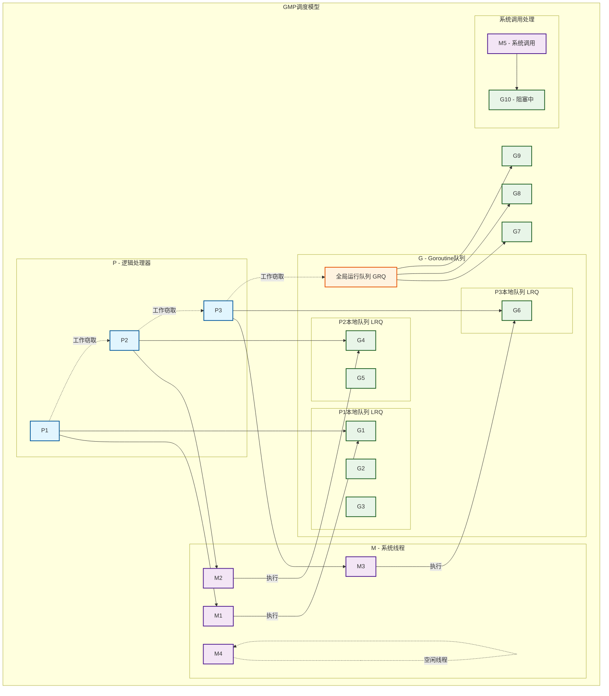
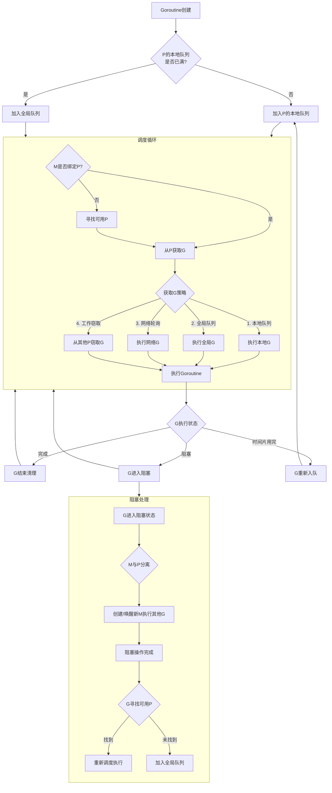
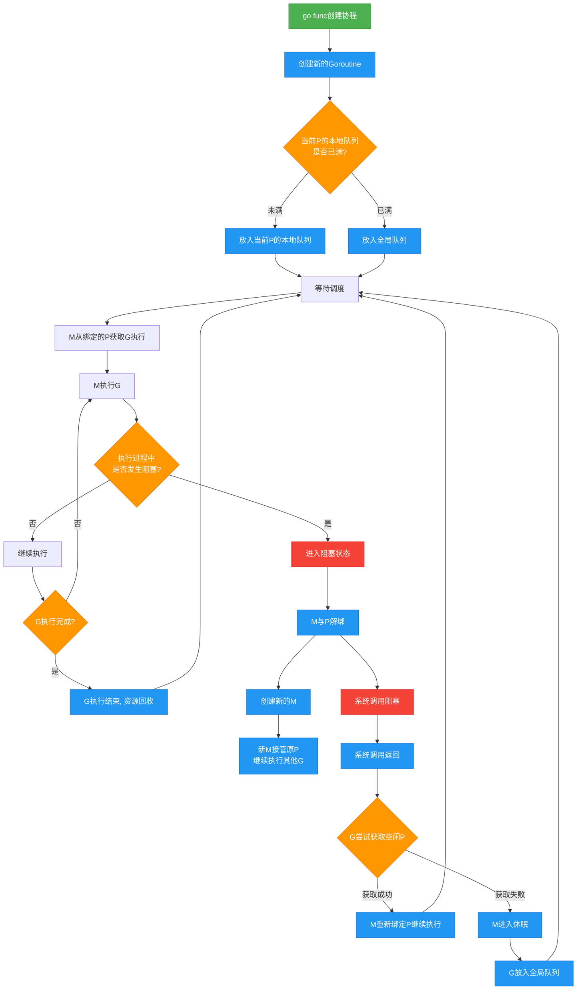
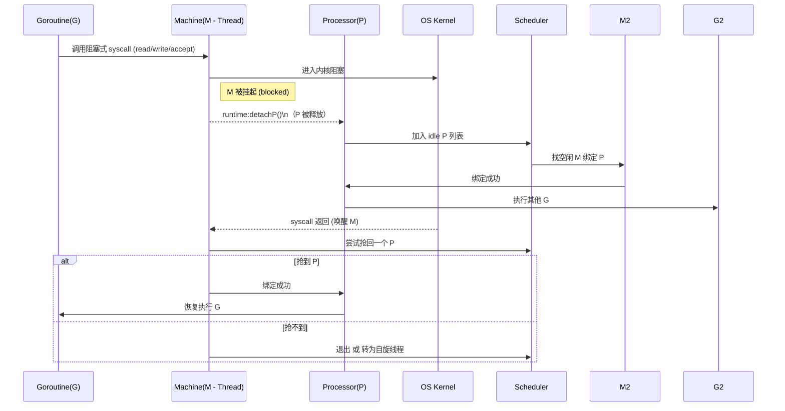
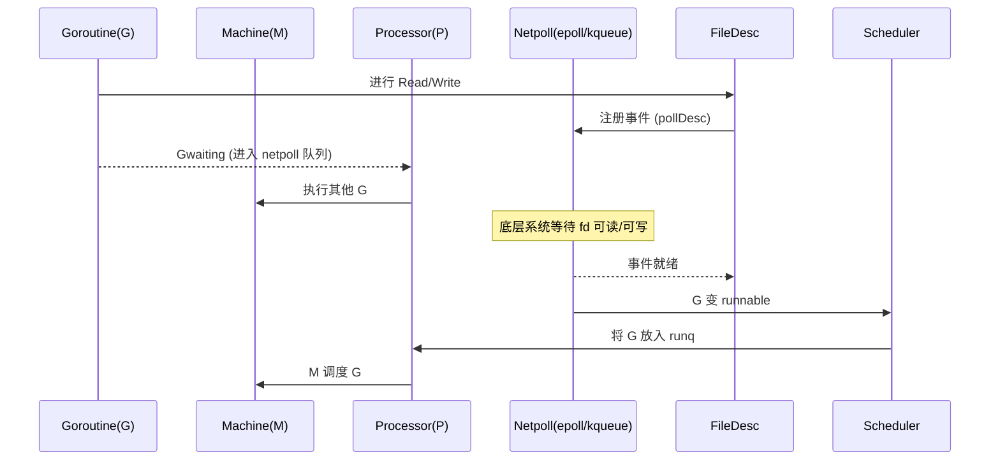
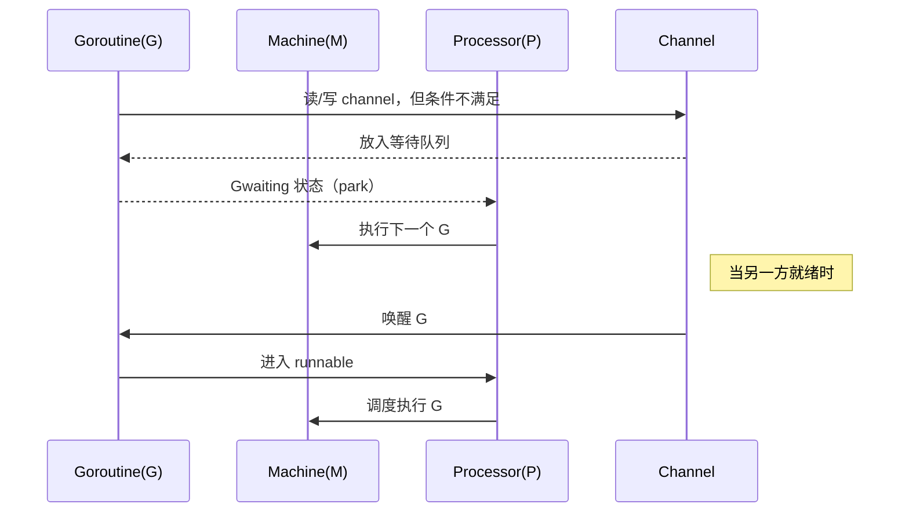
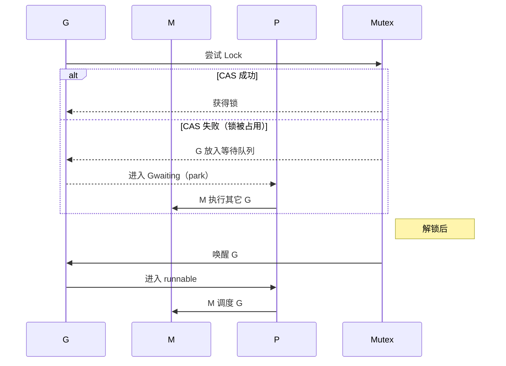
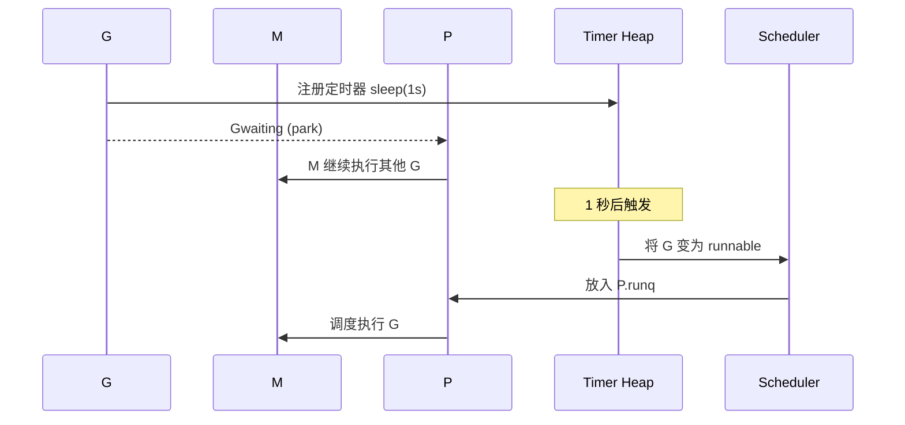
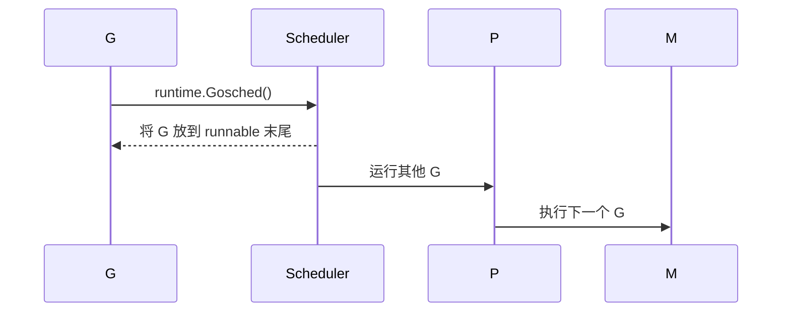
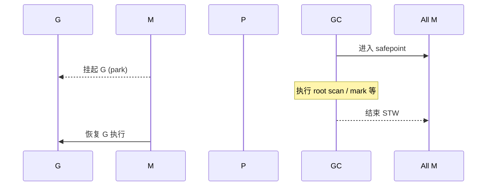

# GMP

## 🟥 一、GMP 模型是什么？

GMP 是 Go runtime 为实现高性能 **用户态调度器（M:N 调度）**而设计的三种核心结构：

| 组件  | 全称      | 作用                                                        |
| ----- | --------- | ----------------------------------------------------------- |
| **G** | Goroutine | 代表用户态协程，是要执行的任务                              |
| **M** | Machine   | 内核线程的抽象，用来执行 G                                  |
| **P** | Processor | 调度器上下文，提供执行 G 的能力（runq、内存分配、调度逻辑） |

## 🟦 二、核心结构详解

### 1️⃣ G：Goroutine（用户态协程）

Goroutine 是 Go 的并发单位，每个 G 包含：

- 栈（初始 2KB，可以增长，动态扩容，最大1GB）
- 状态（_Grunnable、_Grunning、_Gwaiting、_Gsyscall……）
- Sched 信息（保存寄存器、SP、PC）
- 链接关系（next 指针，用于队列）
- Pointers to panic/defer

G 并不包含真正执行能力，它只是"任务描述"。

### 2️⃣ M：Machine（系统线程）

M = 内核线程
每个 M 只能在绑定 P 后执行 G。

M 负责：

- 执行 G 的代码
- 切换 goroutine
- 处理 G 的栈增长
- 处理 syscall

线程数量限制：

- 至多 10,000 左右
- runtime 会动态创建/复用

当 G 调用阻塞系统调用时：

```
M 也被阻塞，但 P 会被解绑并让给其他空闲 M
```

避免整体被卡死。

------

### 3️⃣ P：Processor（调度上下文）

P 代表：

- 能运行 G 的能力
- 调度器逻辑
- 本地运行队列（runq）
- 小对象内存分配器（per-P mcache）
- 暂停/恢复 goroutine 时的状态管理

系统启动时创建 `GOMAXPROCS` 个 P（通常是 CPU 核数）。

**一个 P 必须绑定一个 M 才能运行 G。**

### ▶️ 4. Work Stealing（偷取任务）

当一个 P 的 runq 空了，它会：

1. 尝试从全局队列拿
2. 尝试从其他 P 的 runq 偷**一半**过来
3. 若还没有，则执行 idle 或等待 netpoll

这就是 Go 高效的关键。

------

### ▶️ 5. 网络 I/O：netpoll

G 进行网络 I/O 时是异步的：

- 不会阻塞 M
- 不会占用 P
- 使用 epoll/kqueue/iocp
- 完成后将 G 重新放到 P 的 runq

------

### 🟥 五、调度器为何如此设计？

| 目标             | 解决方案                     |
| ---------------- | ---------------------------- |
| 提高并发能力     | 用户态轻量级线程 G           |
| 利用多核         | GOMAXPROCS = P 的数量        |
| 系统调用不能卡住 | syscall 阻塞 M，但不会阻塞 P |
| 减少锁竞争       | 每个 P 有本地队列            |
| 网络 I/O 异步化  | netpoll 机制                 |
| 高吞吐           | work stealing                |

------





# GMP详细分解说明
进程：计算机程序执行时分配的资源，包括**内存，磁盘空间，打开的文件**等，是操作系统进行资源分配和调度的一  个基本单位，通常包括一个或者多个线程。

线程：是操作系统进行任务调度的基本单位，由操作系统进行调度；线程会共享进程的内存和资源。

协程：协程是用户态的轻量级线程。调度由用户控制。协程之间得切换在用户态完成，切换开销较小。适用于高并发，对任务切换的场景。

## GO

**go中主线程就时一个物理线程**，可以发起对个协程

**go特点：有独立的栈空间，共享程序堆空间；调度由用户控制**
go协程都由runtime管理（新建、恢复、停止、休眠，其中执行异步操作时goroutine会陷入休眠，*不占用系统线程*（这是go协程很方便的一点），当新建或者恢复时加到任务队列中）

goroutine状态：idle,runnable,running,syscall,waiting,dead,copystack

 空闲中(idle): 新建,但未初始化

 待运行(runnable): 在运行队列中, 等待M取出并运行 

运行中(running): 表示machine正在执行这个routine 

系统调用中(syscall): 正在运行的routine发起的系统调用

 等待中(waiting): 在等待某些条件完成,不在执行也不在运行队列中(可能在channel的等待队列中)

 已中止(dead): 未被使用或可能已执行完毕

 栈复制中(copystack): 正在获取一个新的栈空间并把原来的内容复制过去(用于防止GC扫描)

## GMP

G:协程，有自己的栈空间（初始化2k，随需求增长），定时器

M:内核线程，真正运行程序的地方，记录内核线程栈的信息，go被调度到M上时，使用go自己的栈信息

P:调度器，负责调度go，维护本地go列队（G<=256），主线程从调度器上获取go并执行，

关系：P绑定在M上，P的数量<=M，G是通过P调度获取

某一时刻，一个M上只有一个G（g0除外），在P上拥有一个G列队，里面是已经准备就绪的G，可以被调度到M上执行，称为执行列队

全局列队：存放等待运行的G

P的本地列队：优先创建的G会先存入P的本地列队，若本地列队已满，存入全局列队

P列队：程序启动时创建，MAX=*GOMAXPROCS*

M列队：OS分配到的内核线程数


### 调度策略

#### 1复用线程

- work stealing机制：M无可运行的G时，尝试从其他M绑定的P中偷取G（一般是一半）而不是销毁线程
- hand off机制：M由于G发生阻塞时(锁、文件 I/O、网络 I/O 等)，M释放绑定的P，将P转给其他空闲的M线程来执行

#### 2并行

`GOMAXPROCS`设置P的数量，最多有`GOMAXPROCS`个线程分布在多个CPU上同时运行

#### 3抢占：

G最多只能占用CPU 10ms，防止其他协程处于饥饿状态

#### 4全局G列队

当M从work stealing机制获取不到G，可以从全局G列队中获取


### go指令调度流程

- go func() 创建一个协程
- 放入P的本地列队
- M从P中获取G执行
  1. M阻塞，runtime会将M解绑P，然后创建一个新的M来执行这个阻塞的G
  2. M系统调用结束，G尝试获取空闲的P来执行；若取不到P，M则进行休眠，G则放入全局列队




## M0和G0

M0 是启动程序后的编号为 0 的主线程，这个 M 对应的实例会在全局变量 runtime.m0 中，不需要在 heap 上分配，**M0 负责执行初始化操作和启动第一个 G**， 在之后 M0 就和其他的 M 一样了。

G0 是每次启动一个 M 都会第一个创建的 gourtine，G0 仅用于负责调度的 G，G0 不指向任何可执行的函数，每个 M 都会有一个自己的 G0。在调度或系统调用时会使用 G0 的栈空间，全局变量的 G0 是 M0 的 G0。

## GO阻塞分析

### 🟥 一、G 阻塞的几大类情况（G 视角）

G 会阻塞，本质是：

> **G 进入一种无法继续执行的状态，必须等待某个事件发生**
>  （I/O、锁、channel、syscall、sleep、GC 等）

在调度器层面主要分为：

| 阻塞类型                        | 是否导致 M 阻塞 | 是否导致 P 被释放 | 典型例子                      |
| ------------------------------- | --------------- | ----------------- | ----------------------------- |
| **1. 系统调用阻塞（syscall）**  | 是              | **是**            | read、write、accept、File I/O |
| **2. 网络 I/O（异步 netpoll）** | 否              | 否                | TCP read/write                |
| **3. channel 阻塞**             | 否              | 否                | <-ch、ch<-                    |
| **4. mutex（锁）阻塞**          | 否              | 否                | sync.Mutex.Lock               |
| **5. cond / semaphore 等阻塞**  | 否              | 否                | sync.Cond.Wait                |
| **6. time.Sleep 阻塞**          | 否              | 否                | Sleep、Ticker、Timer          |
| **7. runtime park 阻塞**        | 否              | 否                | runtime.park                  |
| **8. GC safe-point 阻塞**       | 否              | 否                | STW 阶段                      |

最关键的结论：

> **只有某些系统调用会阻塞 M，从而释放 P**
>  其它场景大多只阻塞 G，不会把 M/P 挂住。

------

### 🟦 二、深度分析各种阻塞原因

------

### 1️⃣ **系统调用阻塞（最重的阻塞syscall）**

👉 **唯一会阻塞 M 并释放 P 的场景**

当 G 调用阻塞式 syscall，例如：

```
f.Read(buf)
conn.Read(buf)
os.Open(...)
syscall.Syscall(...)
```

此时：

- syscall 是同步的，**不能异步化**
- **M 也会跟着阻塞在内核态**
- runtime 会让 **P 脱离 M**

调度器行为：

```
G → waiting(syscall)
M → blocked(syscall)
P → 解绑，交给其他 M 使用
```

这是避免线程浪费的核心机制。

系统调用返回后：

```
M 苏醒 → 尝试重新绑定 P（可能失败）
```

如果失败，M 会成为 **自旋线程或直接退出**。




------

### 2️⃣ **网络 I/O —— 异步，不阻塞 M**

👉 **G 阻塞，但 M/P 不阻塞（异步 epoll/kqueue）**

Go 的网络 I/O是 **完全异步的**：

- 使用 **netpoller（epoll/kqueue/iocp）**
- 不会阻塞 M
- G 会等待事件回调

行为：

```
G → waiting(netpoll)
M → 空闲继续执行其他 G
P → 不受影响
```

这是 Go netpoll 高性能的关键。




------

### 3️⃣ **channel 阻塞**

👉 **只阻塞 G，不阻塞 M，不释放 P**

两类：

```
<-ch    // 读阻塞
ch <- v // 写阻塞
```

channel 阻塞不需要 M 或 P 离开，只是：

- G 被挂到 channel 的 wait 队列
- M 去执行 P.runq 中的其它 G

行为：

```sh
G → Gwaiting
M → 继续工作
P → 不变
```





------

### 4️⃣ **互斥锁阻塞（Mutex.Lock）**

当 Mutex.Lock 竞争失败：

```
G → 放入 mutex 等待队列
M → 继续执行其他 G
```

不阻塞 M。

注意⚠️
 `sync.Mutex` 有轻量级实现（CAS），未竞争成功时才会进入阻塞。




------

### 5️⃣ **Cond.Wait 或 Semaphore 阻塞**

例如：

```
cond.Wait()
semaRoot.lock()
```

行为完全类似 channel 阻塞：

```
G 被 park
M 继续执行下一个 G
```

也是 **G 阻塞，不阻塞 M**。

------

### 6️⃣ **Sleep / Timer 阻塞**

例：

```
time.Sleep(1 * time.Second)
```

行为：

- G 注册到 timer 堆
- 被 park 挂起
- 定时器到时间后被唤醒（放入 runq）

不阻塞 M：

```sh
G → asleep
M → run next G
```




------

### 7️⃣ **runtime.Gosched / park（主动让出）**

`Gosched` 会使 G 主动进入 runnable：

```
G → runnable
M → 执行其它 G
```

`park` 则把 G 挂起：

```
G → waiting
```




------

### 8️⃣ **GC 阻塞（STW safe-point）**

STW（Stop The World）阶段：

- G 会暂停（等待 GC ）
- M 在 safe-point 处挂起
- P 可能暂时被冻结

频率极低，时间非常短。




------

### 🟧 三、阻塞类型总结图（非常重要）

```
┌───────────────────┬───────────────┬──────────────┬───────────────┐
│ 阻塞类型           │ G 是否阻塞    │ M 是否阻塞    │ P 是否被释放    │
├───────────────────┼───────────────┼──────────────┼───────────────┤
│ syscall           │ ✔             │ ✔             │ ✔              │
│ netpoll (异步IO)   │ ✔             │ ✘             │ ✘              │
│ channel           │ ✔             │ ✘             │ ✘              │
│ mutex             │ ✔             │ ✘             │ ✘              │
│ cond/sema         │ ✔             │ ✘             │ ✘              │
│ sleep/timer       │ ✔             │ ✘             │ ✘              │
│ Gosched/park      │ ✔             │ ✘             │ ✘              │
│ GC STW            │ ✔             │ ✔             │ ✔/✘（视阶段）   │
└───────────────────┴───────────────┴──────────────┴───────────────┘
```

关键：

> **只有 syscall 会让 M 阻塞，从而释放 P。
>  其他类型的阻塞都不会导致 M/P 阻塞，仅阻塞 G 本身。**

------

### 🟩 四、一个非常形象的比喻（面试官喜欢）

- **G 是顾客**
- **M 是柜台服务员**
- **P 是收银机（执行能力）**

各种阻塞对应：

| 情况               | 类比                                               |
| ------------------ | -------------------------------------------------- |
| syscall 阻塞       | 顾客去办卡，柜台人员跟着一起出去，收银机被让给别人 |
| channel/mutex 阻塞 | 顾客在旁边排队等待，不影响柜台人员继续服务下一位   |
| sleep              | 顾客睡觉等闹钟                                     |
| netpoll            | 顾客点外卖，等外卖通知，不影响柜台工作             |
