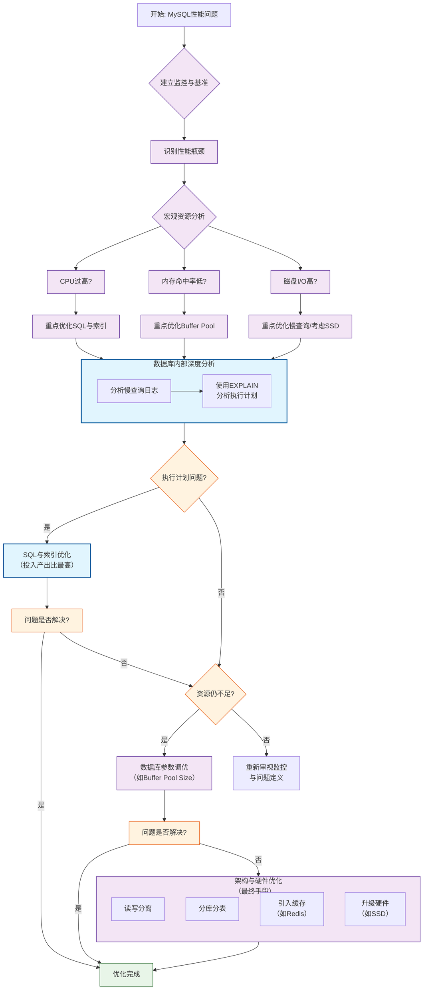

# 性能调优思路




### 核心思想：性能调优金字塔

我们可以将调优过程想象成一个金字塔，从底层到顶层，投入产出比逐渐降低：

1. **架构与SQL语句调优（效果最显著，约70%问题）**
2. **索引优化（效果非常明显，约20%问题）**
3. **数据库参数调优（效果有限，约5%问题）**
4. **硬件与系统调优（成本最高，约5%问题）**

**切记：不要一上来就调整 `my.cnf` 参数，那通常是最后的手段。**

------

### 第一步：确立性能基准与监控

在开始任何优化之前，你必须知道“慢”在哪里。

1. **定义性能指标：**
   - **吞吐量：** QPS（每秒查询数）、TPS（每秒事务数）。
   - **响应时间：** 平均查询时间、95分位/99分位延迟。
   - **资源利用率：** CPU使用率、内存使用率、磁盘I/O（读写IOPS、吞吐量、等待时间）、网络I/O。
2. **建立监控系统：**
   - 使用 `Prometheus` + `Grafana` + `mysqld_exporter` 这套经典组合来持续监控数据库的各项指标。
   - 启用MySQL自带的**性能模式（Performance Schema）** 和**信息模式（INFORMATION_SCHEMA）**，用于深入分析。

------

### 第二步：识别性能瓶颈（发现问题）

当收到性能报警或用户反馈“系统慢”时，按照以下路径快速定位瓶颈。

#### 1. 宏观资源瓶颈

- **CPU过高：**
  - 使用 `top` 命令查看 `%us`（用户态）和 `%sy`（内核态）CPU。
  - 如果 `%us` 高，通常是SQL查询负载过大，需要优化查询或索引。
  - 如果 `%sy` 高，可能是上下文切换过多或系统调用频繁。
- **内存不足：**
  - 检查 `InnoDB Buffer Pool` 命中率。理想情况下应 > 99%。

```mysql
SHOW GLOBAL STATUS LIKE 'innodb_buffer_pool_read%';
-- 计算命中率 = (1 - Innodb_buffer_pool_reads / Innodb_buffer_pool_read_requests) * 100%
```


- - 命中率低意味着大量磁盘读写，需要增大 `innodb_buffer_pool_size` 或优化查询。
- **磁盘I/O瓶颈：**
  - 使用 `iostat -x 1` 查看 `%util`（利用率）和 `await`（平均等待时间）。
  - 如果 `%util` 持续接近100%，`await` 很高，说明磁盘是瓶颈。考虑使用更快的SSD硬盘，或优化大量磁盘写入的操作。
- **网络瓶颈：**
  - 对于大量数据传输的查询，网络带宽和延迟也可能成为瓶颈。

#### 2. 数据库内部瓶颈（核心）

- **使用 `SHOW FULL PROCESSLIST;`**
  - 实时查看当前所有连接正在执行的SQL语句。
  - 重点观察状态为 `Sending data`、`Copying to tmp table`、`Sorting result`、`locked` 的查询。
- **开启并分析慢查询日志（Slow Query Log）**
  - 这是**最强大、最常用**的工具。
  - 在 `my.cnf` 中配置：

```ini
slow_query_log = 1
slow_query_log_file = /var/lib/mysql/slow.log
long_query_time = 1  # 超过1秒的查询被记录
log_queries_not_using_indexes = 1 # 记录未使用索引的查询
```


使用 `mysqldumpslow` 或 `pt-query-digest`（Percona Toolkit）工具分析慢日志文件。

```bash
# 汇总分析慢日志
pt-query-digest /var/lib/mysql/slow.log > slow_report.txt
```


- 分析报告，找到执行时间最长、调用次数最多的“罪魁祸首”SQL。

**使用 `EXPLAIN` 分析单条SQL**

- 对从慢日志中找出的SQL，使用 `EXPLAIN` 或 `EXPLAIN FORMAT=JSON` 查看其执行计划。

```sql
EXPLAIN SELECT * FROM users WHERE name = ‘John’ AND age > 20;
```


- - **关键字段解读：**
    - **type：** 访问类型，从好到坏：`system` > `const` > `eq_ref` > `ref` > `range` > `index` > `ALL`。出现 `index` 或 `ALL` 意味着全表扫描，需要优化。
    - **key：** 实际使用的索引。如果为 `NULL`，说明未使用索引。
    - **rows：** 预估需要扫描的行数。这个值越小越好。
    - **Extra：** 额外信息。出现 `Using filesort`（文件排序）或 `Using temporary`（使用临时表）通常是性能杀手。

------

### 第三步：实施优化（解决问题）

按照金字塔顺序进行。

#### 1. SQL语句与索引优化（最高优先级）

- **索引优化：**
  - **为 `WHERE` 条件和 `JOIN` 条件的列创建索引。**
  - **使用覆盖索引：** 索引包含了查询需要的所有字段，这样引擎无需回表，直接从索引中获取数据。
  - **避免索引失效：**
    - 对索引列进行函数操作（如 `WHERE YEAR(create_time) = 2023`）。
    - 使用 `!=` 或 `<>`。
    - 使用 `OR` 连接条件（有时可以使用 `UNION` 替代）。
    - 模糊查询 `LIKE ‘%abc’`（前导百分号）。
    - 隐式类型转换（如字符串列用数字查询）。
  - **理解最左前缀原则：** 对于联合索引 `(a, b, c)`，查询条件必须包含 `a` 才能使用该索引。
  - **索引区分度：** 选择区分度高的列建索引（`COUNT(DISTINCT column) / COUNT(*)` 越接近1越好）。
- **SQL语句重写：**
  - **避免 `SELECT \*`**，只取需要的列。
  - **分解大连接查询：** 有时将一个大 `JOIN` 分解成多个单表查询，在应用层组装，可以利用缓存，减少锁竞争。
  - **优化 `LIMIT` 分页：** 对于 `LIMIT 10000, 20`，可以改为使用游标分页或基于索引的延迟关联。

```sql
-- 原始（慢）
SELECT * FROM posts ORDER BY created_at DESC LIMIT 10000, 20;
-- 优化后（快）
SELECT * FROM posts INNER JOIN (
  SELECT id FROM posts ORDER BY created_at DESC LIMIT 10000, 20
) AS t USING(id);
```


- - **避免在 `WHERE` 子句中对字段进行 `NULL` 值判断、函数或表达式计算。**

#### 2. 数据库参数调优

在确认SQL和索引已无法再优化后，再考虑调整参数。主要调整 `InnoDB` 相关参数。

- **`innodb_buffer_pool_size`：**
  - **这是MySQL中最重要的参数！**
  - 通常设置为可用物理内存的 50% - 70%。如果这是专用数据库服务器，可以设置得更高。
- **`innodb_log_file_size`：**
  - 重做日志文件大小。设置过小会导致频繁的检查点，影响写入性能。
  - 通常可以设置为 `1G` - `4G`。
- **`innodb_flush_log_at_trx_commit`：**
  - 控制事务的持久性。`1`（默认，最安全但最慢），`2`（折中），`0`（最快但可能丢失约1秒数据）。根据业务对数据安全性和性能的要求进行权衡。
- **`sync_binlog`：**
  - 控制二进制日志刷盘策略。`1`（默认，最安全），`0`（由系统决定）。在主从复制环境中，为了数据一致性通常设为 `1`。

#### 3. 架构与硬件优化

- **读写分离：** 使用主从复制，主库负责写，多个从库负责读，分摊压力。
- **分库分表：** 当单表数据量过大（如千万级以上）时，考虑水平分表或垂直分表。当数据库实例成为瓶颈时，进行分库。
- **使用缓存：** 在应用层和数据库之间加入 Redis 或 Memcached，缓存热点数据，减轻数据库压力。
- **升级硬件：** 最直接但成本最高的方法，包括使用更快的CPU、更大的内存、以及更重要的——NVMe SSD硬盘。

------

### 总结：性能调优闭环流程

1. **监控与度量：** 建立全面的监控，定义清晰的性能指标。
2. **分析与定位：** 利用慢查询日志、`EXPLAIN`、`PROCESSLIST` 等工具，找到瓶颈根源（通常是某几条SQL）。
3. **优化与实施：**
   - **第一刀：** 优化SQL语句本身。
   - **第二刀：** 优化索引。
   - **第三刀：** 调整关键数据库参数。
   - **第四刀：** 进行架构升级（读写分离、分库分表）。
4. **测试与验证：** 优化后，在测试环境进行压力测试，对比优化前后的指标。
5. **部署与观察：** 部署到生产环境，并持续观察监控系统，确认优化效果，形成闭环。

遵循这个思路，你就能系统性地解决绝大多数MySQL性能问题，而不是盲目地东一榔头西一棒子。