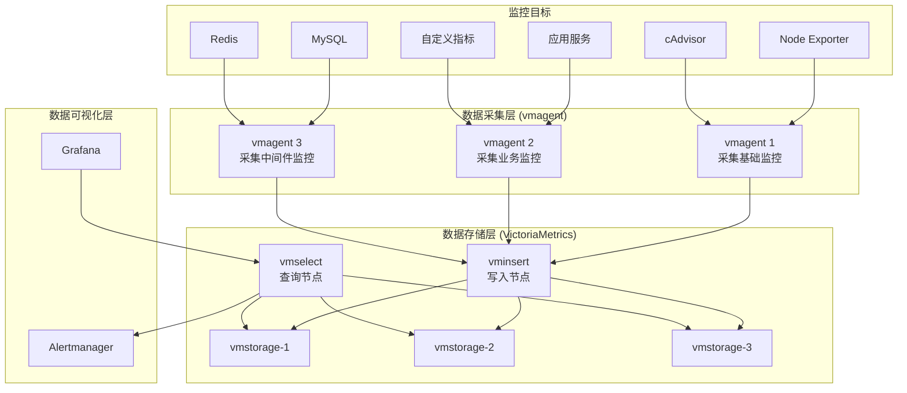
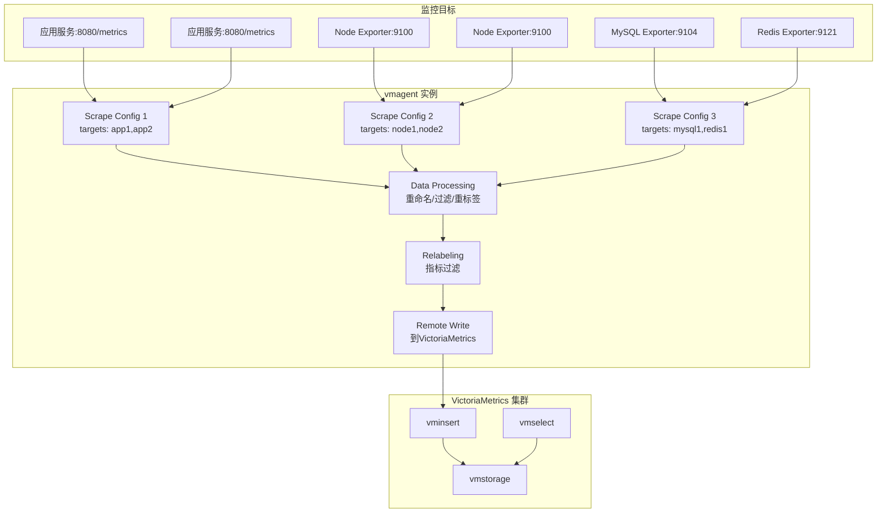
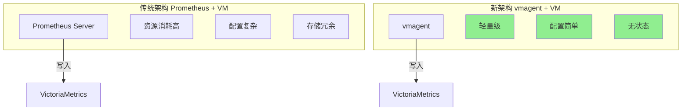
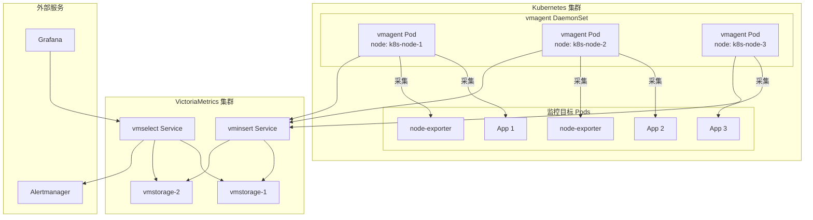
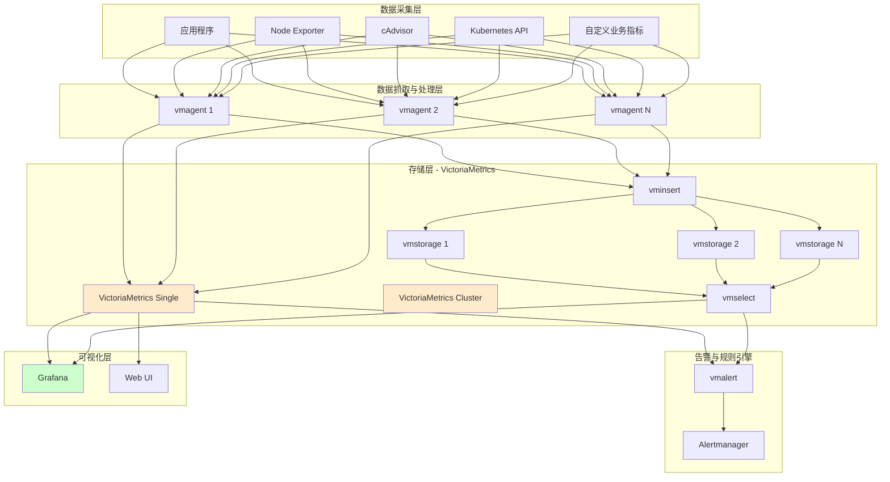

# vm+gafana的监控设计

**VictoriaMetrics 的 vmagent 组件可以完全替代 Prometheus 进行数据采集和写入**，这样可以简化架构并减少资源消耗。

## 使用 vmagent 替代 Prometheus 的架构

### 1. 简化后的整体架构



### 2. vmagent 详细架构




### 3. vmagent 配置示例

yaml

```yaml
# vmagent.yml 配置示例
global:
  external_labels:
    cluster: 'production'
    region: 'us-east-1'

scrape_configs:
  # 采集节点指标
  - job_name: 'node'
    static_configs:
      - targets: ['node-exporter-1:9100', 'node-exporter-2:9100']
    scrape_interval: 15s
    metrics_path: /metrics
    relabel_configs:
      - source_labels: [__address__]
        target_label: instance
      
  # 采集业务应用指标
  - job_name: 'application'
    static_configs:
      - targets: ['app1:8080', 'app2:8080', 'app3:8080']
    scrape_interval: 30s
    metrics_path: /actuator/prometheus
    relabel_configs:
      - source_labels: [__address__]
        target_label: instance
      - source_labels: [__meta_kubernetes_pod_name]
        target_label: pod

  # 采集Kubernetes指标
  - job_name: 'kubernetes-pods'
    kubernetes_sd_configs:
      - role: pod
    relabel_configs:
      - source_labels: [__meta_kubernetes_pod_annotation_prometheus_io_scrape]
        action: keep
        regex: true
      - source_labels: [__meta_kubernetes_pod_annotation_prometheus_io_path]
        action: replace
        target_label: __metrics_path__
        regex: (.+)
      - source_labels: [__address__, __meta_kubernetes_pod_annotation_prometheus_io_port]
        action: replace
        regex: ([^:]+)(?::\d+)?;(\d+)
        replacement: $1:$2
        target_label: __address__

# 远程写入到VictoriaMetrics
remote_write:
  - url: http://vminsert:8480/insert/0/prometheus
    queue_config:
      max_samples_per_send: 10000
      capacity: 100000
      max_shards: 30
```


### 4. 优势对比




### 5. 部署架构






## 关键优势

1. **资源效率**: vmagent 比完整 Prometheus 节省 5-10 倍内存
2. **简化架构**: 减少组件数量，降低运维复杂度
3. **无状态设计**: vmagent 可以轻松水平扩展
4. **相同配置**: 使用与 Prometheus 相同的 scrape_config 格式
5. **数据一致性**: 直接远程写入，避免数据丢失

## 迁移建议

bash

```
# 从 Prometheus 配置迁移到 vmagent
# 1. 复制 scrape_configs
# 2. 配置 remote_write 到 VictoriaMetrics
# 3. 部署 vmagent 并验证数据采集
# 4. 停用原有 Prometheus 服务器
```


使用 vmagent 替代 Prometheus 是推荐的现代化监控架构，特别适合云原生环境和大规模部署场景。