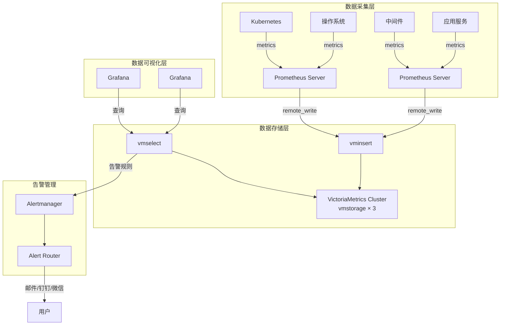
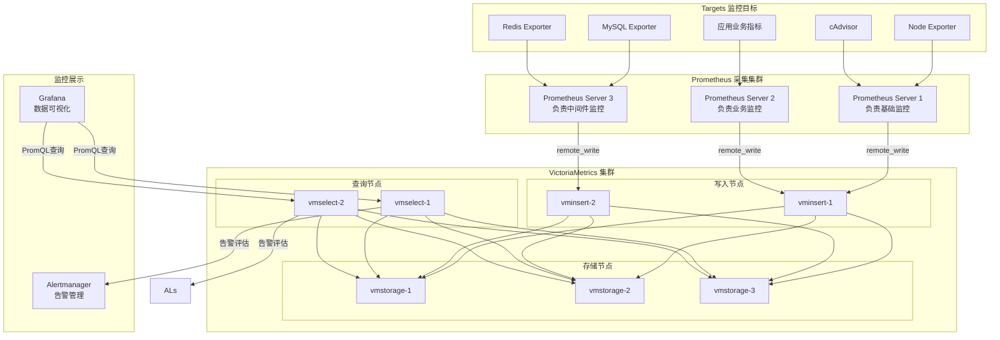
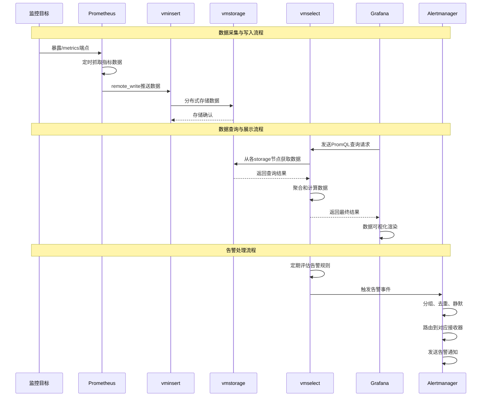

# VictoriaMetrics+Prometheus+Grafana的监控系统架构

## 系统架构设计

### 1. 整体架构图



### 2. 详细组件交互图



### 3. 数据流序列图



## 关键配置说明

### Prometheus 远程写入配置

```yaml
remote_write:
  - url: http://vminsert:8480/insert/0/prometheus
    queue_config:
      capacity: 10000
      max_shards: 30
      min_shards: 1
      max_samples_per_send: 1000
```

### VictoriaMetrics 集群配置

- **vmstorage**: 数据存储，可水平扩展
- **vminsert**: 数据写入，无状态可扩展
- **vmselect**: 数据查询，无状态可扩展

### Grafana 数据源配置

```yaml
datasources:
  - name: VictoriaMetrics
    type: prometheus
    url: http://vmselect:8481/select/0/prometheus
    access: proxy
```

这种架构提供了高可用性、水平扩展能力和优异的查询性能，适合大规模监控场景。