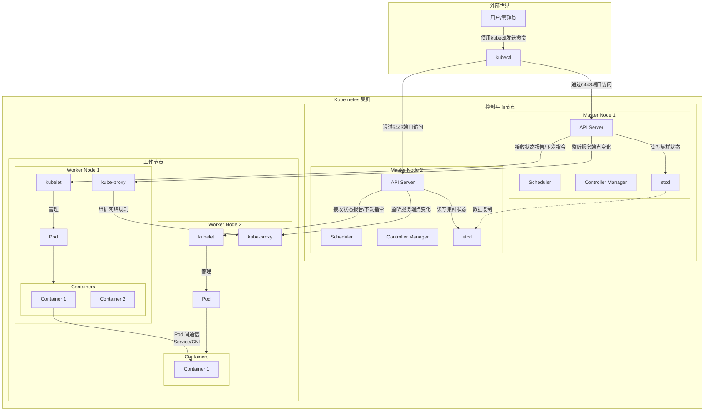

# 👨‍💻打码中......

```shell
# 配置修改
kubectl edit deployment <deployment-name>


```



```mermaid
flowchart TD
    subgraph Cluster [Kubernetes 集群]
        subgraph ControlPlane [控制平面节点]
            subgraph MasterNode1 [Master Node 1]
                A1[API Server]
                S1[Scheduler]
                C1[Controller Manager]
                E1[etcd]
            end
            
            subgraph MasterNode2 [Master Node 2]
                A2[API Server]
                S2[Scheduler]
                C2[Controller Manager]
                E2[etcd]
            end

            A1 -- 读写集群状态 --> E1
            A2 -- 读写集群状态 --> E2
            E1 -. 数据复制 .-> E2
        end

        subgraph WorkerNodes [工作节点]
            subgraph WorkerNode1 [Worker Node 1]
                N1[kubelet]
                P1[Pod]
                subgraph P1_Containers [Containers]
                    C1_1[Container 1]
                    C1_2[Container 2]
                end
                P1 --> P1_Containers
                N1 -- 管理 --> P1
                
                KP1[kube-proxy]
            end

            subgraph WorkerNode2 [Worker Node 2]
                N2[kubelet]
                P2[Pod]
                subgraph P2_Containers [Containers]
                    C2_1[Container 1]
                end
                P2 --> P2_Containers
                N2 -- 管理 --> P2
                
                KP2[kube-proxy]
            end
        end

        %% 控制平面与工作节点的通信
        A1 -- 接收状态报告/下发指令 --> N1
        A2 -- 接收状态报告/下发指令 --> N2
        A1 -- 监听服务端点变化 --> KP1
        A2 -- 监听服务端点变化 --> KP2

        %% 工作节点之间的通信
        KP1 -- 维护网络规则 --> KP2
        C1_1 -- Pod 间通信<br/>Service/CNI --> C2_1
    end

    subgraph External [外部世界]
        User[用户/管理员]
        CLI[kubectl]
    end

    %% 外部访问
    User -- 使用kubectl发送命令 --> CLI
    CLI -- 通过6443端口访问 --> A1
    CLI -- 通过6443端口访问 --> A2
```

